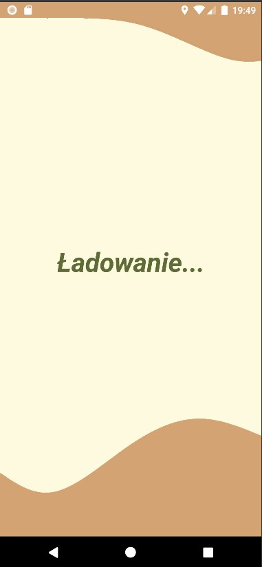
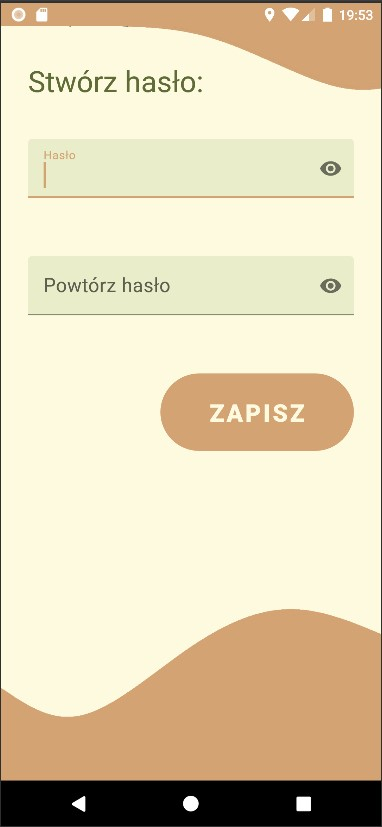
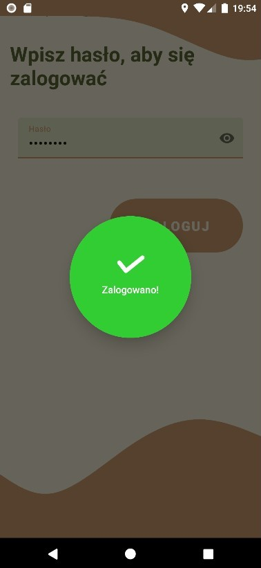
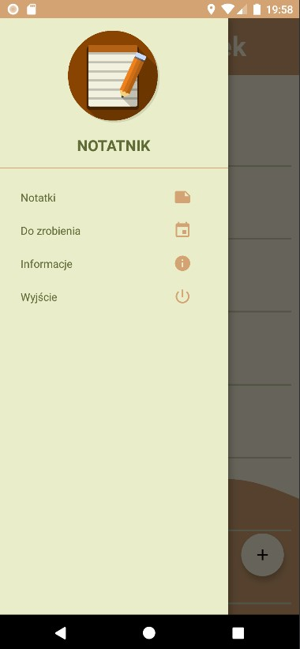
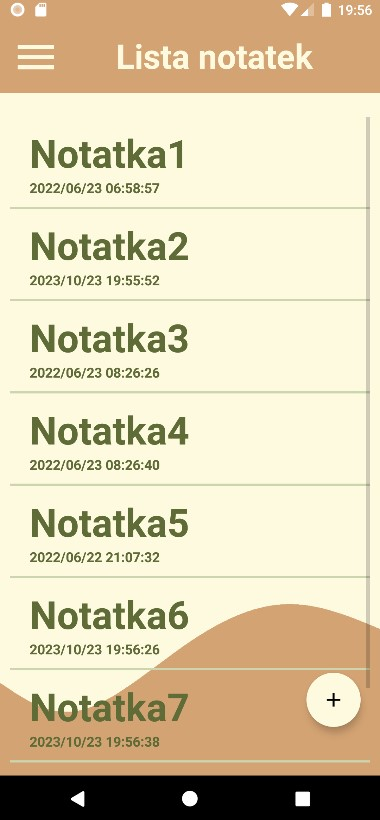
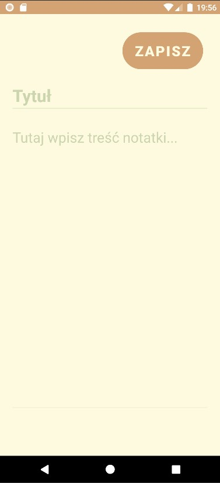
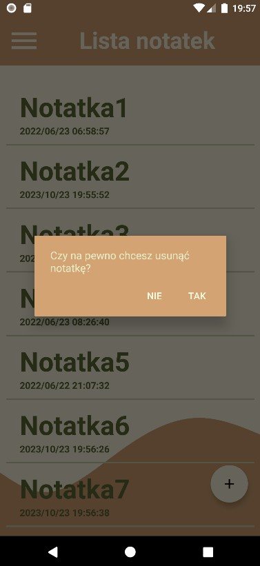
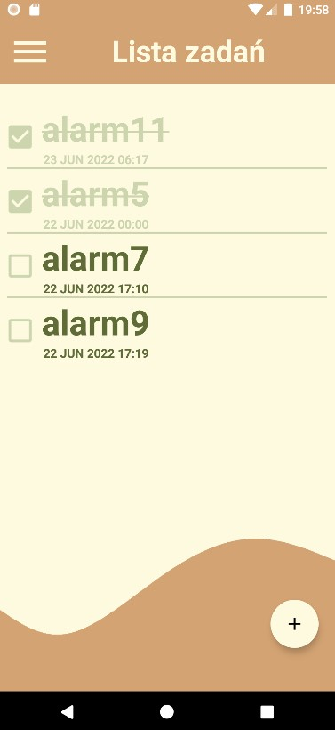
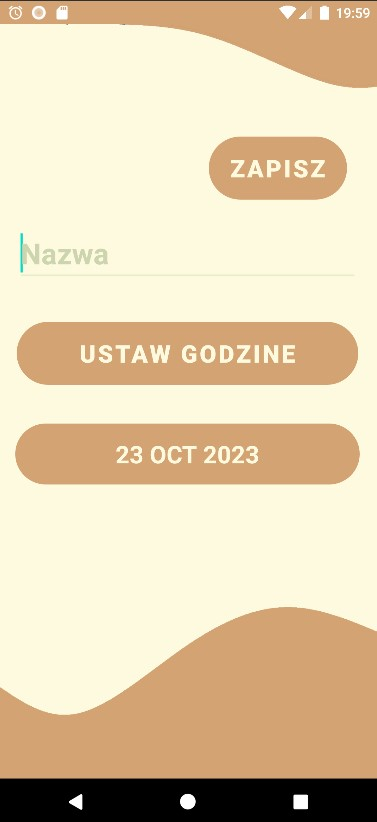

# Simple Notes and Tasks App

This is a basic mobile application for creating and managing notes and tasks. The app uses Firestore Database for data storage, and for educational purposes, it implements a login mechanism using SharedPreferences.

## Features
* Create, edit, and delete notes.
* Add tasks, mark them as completed, and delete them.

  |  | 
 |:--:|:--:|:--:|
| *Application Loading* | *Password Creation* | *Successful Login Notification* |
  |  | 
| *Menu* | *Note List* | *Adding a New Note* |
  |  | 
| *Deleting a Note* | *Task List* | *Adding a New Task* |
